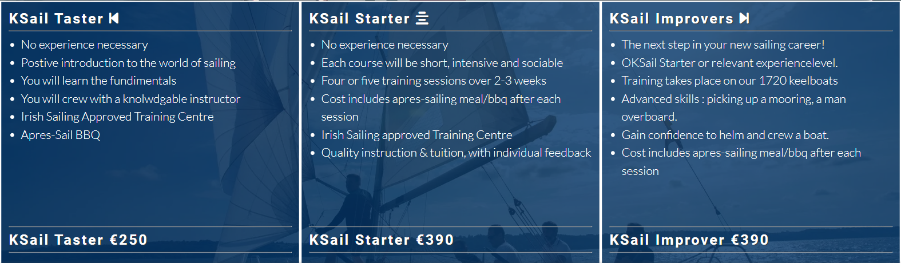

# KSail - Adult sailing courses

KSail is a microsite focused on adult sailing courses.
It is broadly designed around an exisiting page on the Royal St. George Yacht Club.
The KSail site is how I would invisage a website for adult sailing courses would look if I was asked to design and develop one.

KSail is developed, based on real discussions and observations.
While the information on the site is not real, the methodology of providing a business case, personas and user stories is real life.

The link to the live KSail website is here: [KSail](https://doyle-kfd.github.io/KSail/)

## The approach I took

Intro

Agenda

Project Introduction

What Problem I Solve

Target Audience

Persona 1

Persona 2

User Story - Sid The Sailor

User Story - Mary The Mermaid

Proposed Solution

I Will Deliver

## Design

### Overall comments
The current Adult Sailing web presence does not give the site visitors a "WOW" feeling. The textual content is clear and informative but is not supported by a user experience which will encourage the site visitor to make a decision to sign up or pay.

### Imagery
The imagery used in the KSail is selected to give the visitor a comfort feeling that they have arrived in the right place. It features sailboats similar to those that they will train on with imagery of people from the age demographic that KSail is targeting.

### Colours
THe colors are those of the RSGYC, Royal St. George Yacht Club. I have used the Blue as much as possible and gone as light on the red as possible.

### Fonts
The fonts used are from Google's library
- For Headings [Roboto](https://fonts.google.com/specimen/Roboto)
- For Text [Lato](https://fonts.google.com/specimen/Lato)

## Wireframes

Mobile Phone

Tablet

Laptop

## Features and benefits

### Navigation
- The responsive navigation bar links the logo, Home, About, Gallery and Contact pages.
- Th Nav bar is fixed in position, allowing navigation while scrolling
- Aesthetically, there is a drop shadow which gives a 3D effect.

### Footer
- The footer is visible on each page and has links to Facebook, Instagram, YouTube, WhatsApp and a phone number. These links have been selected based on customer feedback. The idea of having a phone number and a WhatsApp icon on the footer is to allow the site visitor contact the sales team directly from the phone.
- The drop shadow on the footer is in reverse of the header one. It give the aesthetically pleasing effect of a 3D experience.

### Index

- #### Note:
    - The index page has been designed with the visitors first impression in mind.
    - The page is focused on selling the experience, from whats in it for you to what we provide.
    - The imagery and text is based on the targeted demographic in the personas.

- ####  Hero Section 

    - The hero image with text sets the scene for the site visitors first experience.
    - The image is one from the type of sailing boat they will use on the course.
    - The image and the text provides a clear expectation of what the visitor will experience.
    - The text with the opque background have both  been given a drop shadow to make them stand out for contrast purposes.

- #### Reasons Section
    - The reasons section is used to articlate the exciting and fun reasons that a visitor would want to join KSail.
    - These 4 reasons are based on the bullseye customer that signs up for a KSail course.
    - These 4 reasons are used to set the fun and excitement element to the Ksail courses.

- #### KSail Intro
    - The KSail hero image is the introduction section to the page. The visitor has seen at the top they are in the right place. The benefits have been explained, now I introduce the courses.
    - The KSail hero image shows the type of sailboats the visitor would be on.
    - The KSail hero image shows the type of people I am targeting.
    - The text has been given a drop shadow on an opqaue background which has a drop shadow in order to give it a contrast.

- #### KSail Courses
    - The KSail courses are fully responsive
    - The KSail courses detail exactly what they can expect from each course.
    - The KSail courses show the progression possible from sampler to sailor to improver
    - There is no disctraction with other unrelated courses or detail.
    - The courses are layered over a background image with an opaque color for text contrast.
    - The titles have been given a drop shadow to help them stand out.

### About

- #### Note:
    - I consider the About page as a necessity but was not initially included as MVP.
    - The page lends credibility to our courses by showing that we have offerings that would suit someone who is looking for more than a weekend of sailing.

- #### About Hero Section
    - The hero image and the supporting text is used to show that behind KSail there is a club and the clubs motto.
    - The motto "No Boat No Problem" is used to give the site visitor the message that you dont need to own your own boat to sail.
    - The club is always looking for suitable members and KSail is an opportunity to offer trainees the opportunity to sample club life.

- #### Welcome to the club section
    - The welcome section displays the club sailor offering. 
    - The 5 sections detail what the club has to offer with a color overlay on a background image to give textual contrast.

- #### Clubs within the club section
    - This section details the depth within the sialing club. There are numerous options available if you are a member.
    - The imagery used in this section is all selected to imply quality.
    - The use of the age differences in the snooker image are chosen to show the age differences that members cover.
    - The title in each section has been given an opaque background and a drop shadow to make the text stand out.

### Gallery
- #### Note:
    - The gallery is based on a responsive mosaic style.
    - The images used are based on the target demographic from our personas and show the type of sailing boats the visitor can expect to use.

- #### Mosaic Gallery
    - The gallery has been designed using flexbox.
    - The gallery grows as the device breakpoints are engaged.

### Contact
- #### Note:
    - The contact form has been given its own page
    - The contact page gives all the details necessary to make an enquiry or visit or phone

- #### Contact Form
    - The contact form is overlaying a background image.
    - The form has an opqaue background to give the text contrast.
    - The contact form also has the postal address if the site visitor would like to do more research or visit.
    - The form allows the user make a selection based on the course they would like to discuss.
    - The course option on the form is used to help the club sales team understand the context of the enquiry.

- #### Map
    - The map on the page allows the site visitor see where the course is held.
    - The map resizes based on the device.
    - The visitor can use the map to see how far they are from the location and directions to it.

## Items left to implement

## Deployment

## Cloning

## Credits

## What I would have added

# Testing

## Feature Testing

## Browser Compatability

## Responsiveness

## Code Validation

## Bugs

## Lighthouse

## Accessibility
